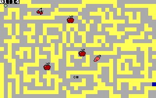

# MazeAssembly

Race against the clock to reach the end of the maze and collect prizes along the way. 

# Installation 
Download the maze.exe from the src directory. This is the executable file of the maze. 

You can run it in a windows machine using the 
<a href="https://www.dosbox.com/">DOSBOX emulator</a>. DOSBOX is a program which emulates an environment of a x86 MS-DOS environment. It is compatible to the maze, which is written entirely on assembly x86.

# Usage
After downloading DOSBOX, simply grab the maze.exe to DOSBOX. This will execute the program.

